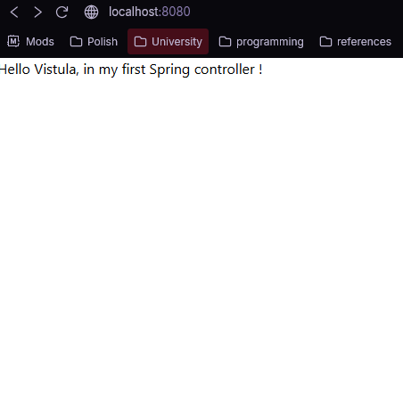
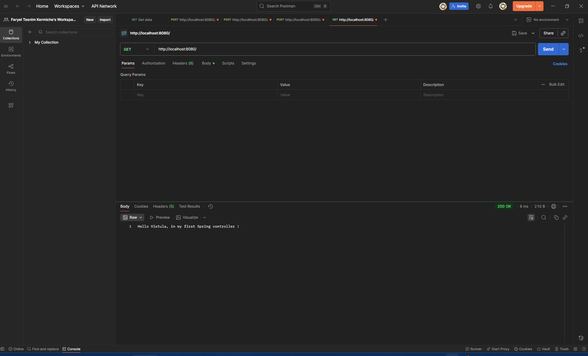
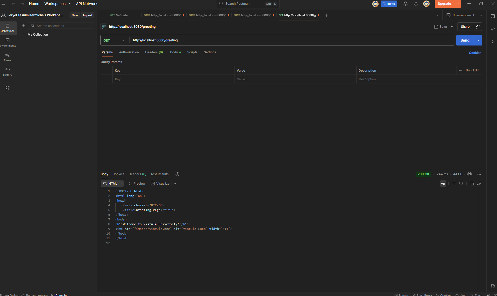
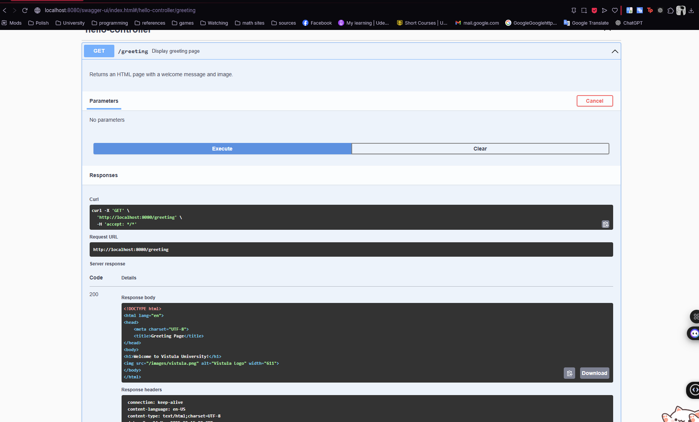

# My Spring Boot Project Task 1

## Project Description
This project is a simple web application developed using the **Spring Boot framework** as part of the Java Spring Framework course at Vistula University.  
It demonstrates the basic use of controllers, routing, static resources, and the Thymeleaf template engine.

The application contains two HTTP endpoints: one that returns a plain text message and another that renders an HTML page containing a dynamic message and an image.

## Technologies Used
- Java 17  
- Spring Boot 3.x  
- Maven  
- Thymeleaf  
- IntelliJ IDEA  
- Postman (for API testing)

## How to Run the Application
1. Open the project in **IntelliJ IDEA**.  
2. Run the `FirstProjectJavaSpringApplication` class.  
3. Once the application starts, open the following URLs in your browser:
   - `http://localhost:8080/` — displays a plain text message.  
   - `http://localhost:8080/greeting` — displays the HTML greeting page with a dynamic message and an image.

## Endpoints
| HTTP Method | URL Path | Description |
|--------------|-----------|-------------|
| GET | `/` | Returns a plain text message confirming that the application is running. |
| GET | `/greeting` | Returns a Thymeleaf-rendered HTML page containing a welcome message and an image. |

## Testing
The application can be tested using:
- **Web browser:** to verify the responses of both endpoints.  
- **Postman:** to send `GET` requests and inspect the returned data.  
If Swagger documentation is required, the dependency `springdoc-openapi-starter-webmvc-ui` can be added to `pom.xml` to enable an interactive API interface.

## .gitignore
A `.gitignore` file is included to prevent unnecessary or environment-specific files from being pushed to the repository.  

## Screenshots

### Greeting Page on http://localhost:8080

### Greeting Page including PNG logo on http://localhost:8080/greeting 

### Greeting Pages on Postman

In Postman, we can test that the /greeting endpoint returns a valid HTML response. The image itself doesn’t show up here because Postman doesn’t render web pages; but it does confirm that the controller and template are working.

### Greeting Pages on Swagger

The /greeting endpoint returns an HTML page with an embedded image. In Swagger and Postman we only see the raw HTML code because they don’t render web pages, but in the browser the image loads correctly from the /images directory.

## Author
**Name:** Feryel Tesnim Kermiche
**Student Number:** 74450
**University:** Vistula University  
**Course:** Java Spring Framework  
**Task:** 1 – Spring Boot Web Application
